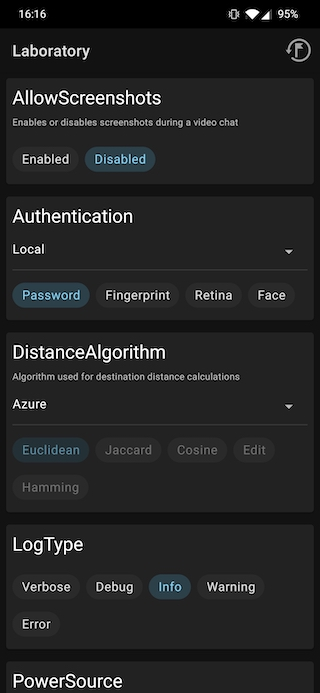
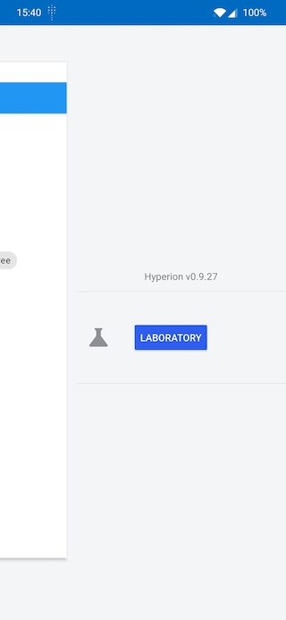

# Laboratory

[](https://app.bitrise.io/app/148b95503bea5e3f)

[](https://search.maven.org/search?q=g:io.mehow.ruler)
[](https://www.apache.org/licenses/LICENSE-2.0)

Feature flags for multi-module Java and Android projects.

## Overview

Laboratory simplifies feature flags access and management using single interface.

```kotlin
@Feature // This annotation is optional. It informs R8 to not shrink or obfuscate enums.
enum class AuthMethod {
  None, Fingerprint, Face
}

class IntroductionPresenter(private val laboratory: Laboratory) {
  // Read feature from the laboratory.
  fun onIntroductionFinished() = when(laboratory.experiment<AuthFeature>) {
    AuthMethod.None -> TODO("Go to the main screen")
    AuthMethod.Fingerprint -> TODO("Show fingerprint scanner")
    AuthMethod.Face -> TODO("Show face scanner")
  }
}

class SettingsPresenter(private val laboratory: Laboratory) {
  // Change feature value.
  fun setAuthMethod(method: AuthMethod) = laboratory.setFeature(method)
}
```

By default, if a feature is not set, the first enum value is used as a fallback. `Laboratory` instances delegate their work to a `FeatureStorage` interface that you generally do not have to use in your application code.

| Artifact                                               | Description                                                                                                                                     |
| ------------------------------------------------------ | ----------------------------------------------------------------------------------------------------------------------------------------------- |
| `io.mehow.laboratory:laboratory:0.1.0`                 | Core of the library. Defines classes and interfaces that you should interact with. It also provides a `Laboratory.inMemory()` method for tests. |
| `io.mehow.laboratory:laboratory-android:0.1.0`         | Provides implementation of `FeatureStorage` based on `SharedPreferences` and adds R8 rules for features.                                        |
| `io.mehow.laboratory:laboratory-inspector:0.1.0`       | QA module that allows to preview all features and change them at runtime from one place.                                                        |
| `io.mehow.laboratory:laboratory-hyperion-plugin:0.1.0` | QA module that integrates `laboratory-inspector` with the [Hyperion](https://github.com/hyperion-project/hyperion).                             |
| `io.mehow.laboratory:laboratory-gradle-plugin:0.1.0`   | Gradle plugin for feature management. It is highly recommended to be used when `laboratory-inspector` is availalbe in the application.          |
| `io.mehow.laboratory:laboratory-generator:0.1.0`       | Generates feature flags and feature flag factory classes.                                                                                       |

## QA support

Often, it is a good practice to have a way of changing features at runtime. Laboratory helps with that with its QA artifacts.

`laboratory-inspector` provides `LaboratoryActivity` that can show a preview of all features with a possibility to modify them. However it requires some upfront initialization. The place to do this is your application class. After initialization you can open the activity to interact with the features.

```kotlin
class SampleApp : Application() {
  override fun onCreate() {
    super.onCreate()
    val factory = TODO("Get factory.")
    val storage = TODO("Get storage.")
    LaboratoryActivity.initialize(factory, storage)
  }
}

// Somewhere in the application
fun openLaboratory(context: Context) {
  LaboratoryActivity.start(context)
}
```

A `FeatureStorage` instance should come from the DI graph and must be shared with `Laboratory` instances in order to keep changes in sync. A `FeatureFactory` should return all enum classes that should be used as features. You can provide your custom implementation but it should be easier to rely on `laboratory-gradle-plugin` to do this job.

| Inspector                 | Hyperion                 |
|:-------------------------:|:------------------------:|
|  |  |

## Gradle plugin

You can use Laboratory without Gradle plugin but if you intend to integrate it with any of the available QA features it is better to automate you work with the plugin. Plugin is responsible for generating feature enums, generating `FeatureFactory` that provides features generated by the plugin in any module, and for adding appropriate dependencies to the module. It will add `laboratory`  dependency for Kotlin modules and `laboratory-android` for Kotlin Android modules. Plugin generates Kotlin source code so **it won't work with pure Java modules**.

Here is a sample plugin configuration.

```groovy
plugins {
  id("org.jetbrains.kotlin.jvm")
  id("io.mehow.laboratory")
}

laboratory {
  packageName = "io.mehow.sample"

  factory()

  feature("Brombulation") {
    withValue("Enabled")
    withValue("Disabled")
  }

  feature("Frombulation") {
    withValue("Enabled")
    withValue("Disabled")
  }

  feature("Trombulation") {
    withValue("LevelOne")
    withValue("LevelTwo")
    withValue("LevelThree")
  }
}
```

This configuration adds two Gradle tasks (`generateFeatureFlags` and `generateFeatureFactory`) that will run before compilation. They are responsible for generating the following classes.

```kotlin
package io.mehow.sample

// Generated by 'generateFeatureFlags'

@Feature
enum class Brombulation {
  Enabled, Disabled
}

@Feature
enum class Frombulation {
  Enabled, Disabled
}

@Feature
enum class Trombulation {
  LevelOne, LevelTwo, LevelThree
}

// Generated by 'generateFeatureFactory'.

internal fun Laboratory.Companion.generated(): FeatureFactory = GeneratedFeatureFactory

private class GeneratedFeatureFactory : FeatureFactory {
  @Suppress("UNCHECKED_CAST")
  override fun create() = setOf(
    Class.forName("io.mehow.sample.Brombulation"),
    Class.forName("io.mehow.sample.Frombulation"),
    Class.forName("io.mehow.sample.Trombulation")
  ) as Set<Class<Enum<*>>>
}
```

`GeneratedFeatureFactory` does not use feature classes directly as they might be internal to the contributing modules or available only as transitive dependencies.

Here is the full configuration of the plugin.

```groovy
// Adds 'generateFeatureFlags' task to the module.
laboratory {
  // Sets namespace of generated features and factories. Empty by default.
  packageName = "io.mehow.sample"

  // Adds 'generateFeatureFlags' task to the module. Optional.
  factory {
    // Overrides globally declared namespace. No value by default.
    packageName = "io.mehow.sample.factory"

    // Sets visibility of a factory extension function to be either 'public' or 'internal'. 'false' by default.
    isPublic = true

    // Excludes projects from contributing features to this factory. Includes all projects by default.
    excludeProjects { project -> true }
  }

  // Informs plugin to create 'enum class SomeFeature' during generation period.
  feature("SomeFeature") {
    // Overrides globally declared namespace. No value by default.
    packageName = "io.mehow.sample.feature"

    // Sets visibility of a feature flag to be either'public' or 'internal'. 'true' by default.
    isPublic = false

    // Informs plugin to add 'ValueA' and 'ValueB' values to the generated feature flag.
    withValue("ValueA")
    withValue("ValueB")
  }
}
```

## Integration

Laboratory requires Java 8 bytecode. To enable Java 8 desugaring configure it in your Gradle script.

```groovy
android {
  compileOptions {
    sourceCompatibility JavaVersion.VERSION_1_8
    targetCompatibility JavaVersion.VERSION_1_8
  }
  // For Kotlin projects
  kotlinOptions {
    jvmTarget = "1.8"
  }
}
```

## License

    Copyright 2020 Michał Sikora

    Licensed under the Apache License, Version 2.0 (the "License");
    you may not use this file except in compliance with the License.
    You may obtain a copy of the License at

       http://www.apache.org/licenses/LICENSE-2.0

    Unless required by applicable law or agreed to in writing, software
    distributed under the License is distributed on an "AS IS" BASIS,
    WITHOUT WARRANTIES OR CONDITIONS OF ANY KIND, either express or implied.
    See the License for the specific language governing permissions and
    limitations under the License.
